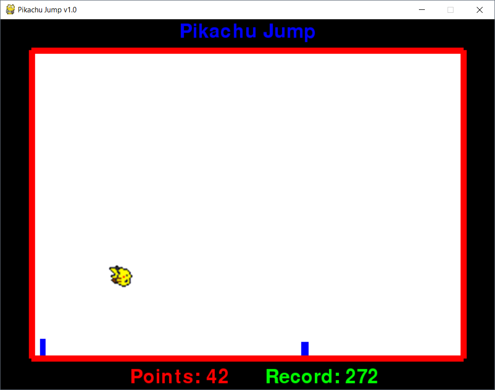
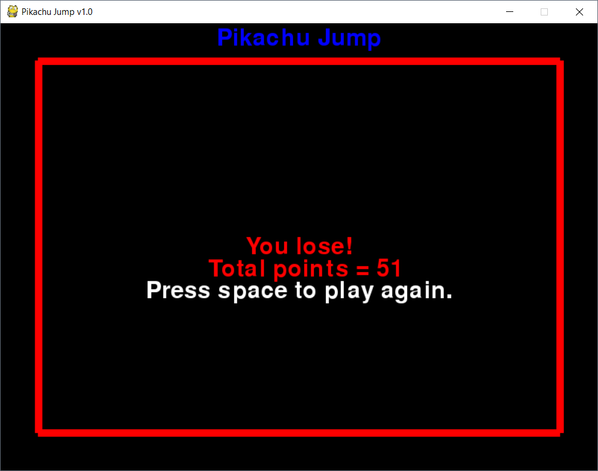

# Pikachu jump

Pikachu jump is a simple Python platform game created with the Pygame library.
Press space to jump and try to avoid the blue obstacles!
Record score is saved in plain text in record.txt file.

## Prerequisites

To run this program you need Pygame installed. Install it with:

```
pip install pygame==1.9.4
```

## Screenshots




## License

This project is licensed under the MIT License - see the [LICENSE](LICENSE) file for details
